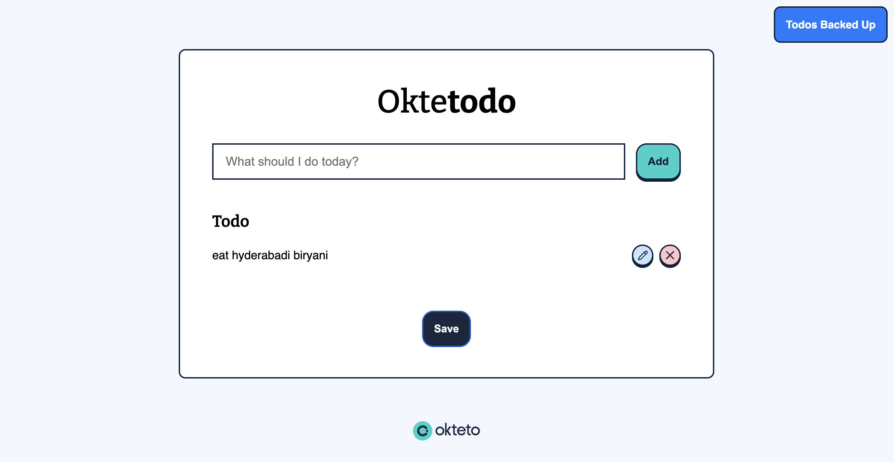

footer: @RinkiyaKeDad
slidenumbers: true
slide-transition: true
build-lists: true

# [fit] Creating a More 
# [fit] **Cloud-Native**
# [fit] Development Experience
Arsh Sharma, Okteto

---

# What is Development Experince?
DevX refers to the overall experience that developers have while working with a particular set of tools, technologies, frameworks, or platforms. 

---

# Current Cloud Native DevX



---

# Current Cloud Native DevX

* microservices code
* databases
* cloud services
* devops tools like terraform, helm, etc


---

## Why Kubernetes for Dev Platforms?

* Containerized Environment
* Consistency Across Environments
* Service Discovery
* Scalability and Resource Efficiency
* Ecosystem and Extensibility

---

## Okteto CLI

* [github.com/okteto/okteto](https://github.com/okteto/okteto)
* **Platform Engineers**: Define dev environments which will run on K8s
* **Developers**: One click deploy and develop applications directly in the cluster (`okteto up`)

---

## [fit] **Demo!**

---

## **Try it out!**


---

## Build Section


    
```yaml
build:
  server:
    context: server
  client:
    context: client
```

---

## Deploy Section


```yaml
deploy:
  image: hashicorp/terraform:1.4

  commands:
  - name: Create the AWS S3 Bucket
    command: |
        terraform init -input=false
        terraform apply -input=false -auto-approve

  - name: Create the AWS secret
    command: |
        kubectl apply -f aws-secret.yaml
```

---

## Deploy Section


```yaml
deploy:
    ...
  - name: Deploy the DB
    command: helm upgrade --install db db/chart

  - name: Deploy the Node.js Backend
    command: helm upgrade --install server server/chart \
             --set image=${OKTETO_BUILD_SERVER_IMAGE} \
             --set bucket="$S3_BUCKET_NAME"

  - name: Deploy the React Frontend
    command: helm upgrade --install client client/chart \
             --set image=${OKTETO_BUILD_CLIENT_IMAGE}
```
---

## Develop Section


```yaml
dev:
  server:
    command: bash
    sync:
      - server:/app
  client:
    command: npm start
    sync:
      - client:/app
```

---

# [fit] **Thanks**
# [fit] **for attending!**
For questions, reach out to me on Twitter: [@RinkiyaKeDad](https://twitter.com/RinkiyaKeDad)