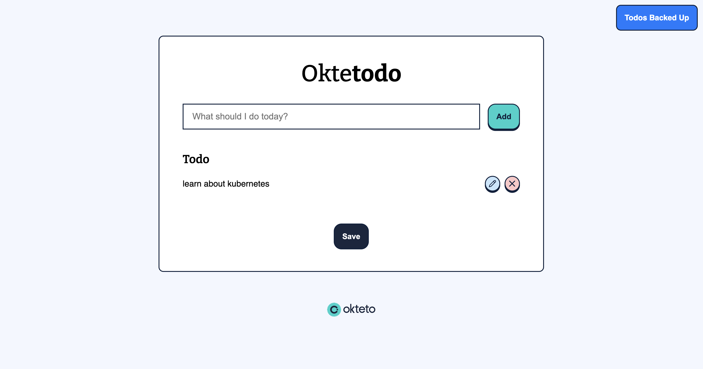
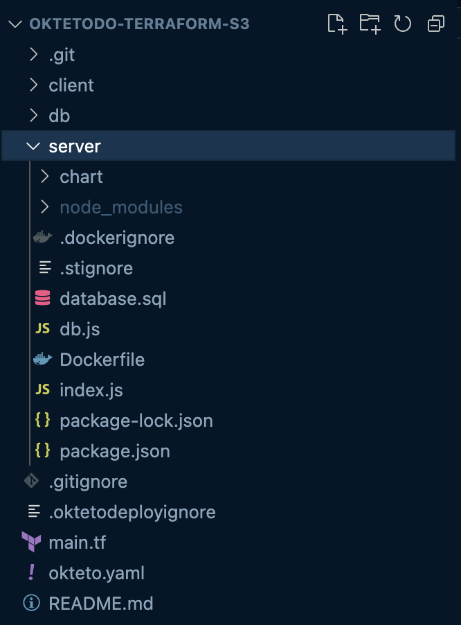

# Leveraging Kubernetes as the Foundation for Your Development Environments

By Arsh Sharma, Okteto

---

## What are Development Environments?
* A development environment encompasses all processes and tools that are used by developers when working on applications.

---

## Current State of Development



---

## Current State of Development

* microservices code
* databases
* cloud services
* devops tools like terraform, helm, etc

---

## Why Kubernetes?

* Containerized Environment
* Consistency Across Environments
* Service Discovery
* Scalability and Resource Efficiency
* Ecosystem and Extensibility

---

## Okteto CLI

* [github.com/okteto/okteto](https://github.com/okteto/okteto)
* Define dev environments which will run on K8s (`okteto deploy`)
* Hot reload and develop applications directly in the cluster (`okteto up`)

---

## Build Section


    
```yaml
build:
  server:
    context: server
  client:
    context: client
```

---

## Deploy Section


```yaml
deploy:
  image: hashicorp/terraform:1.4

  commands:
  - name: Create the AWS S3 Bucket
    command: |
        terraform init -input=false
        terraform apply -input=false -auto-approve

  - name: Create the AWS secret
    command: |
        kubectl create secret generic aws-credentials \
        --save-config \
        --dry-run=client \
        --from-literal=AWS_SECRET_ACCESS_KEY="$AWS_SECRET_ACCESS_KEY" \
        --from-literal=AWS_ACCESS_KEY_ID="$AWS_ACCESS_KEY_ID" \
        -o yaml | kubectl apply -f -
```
---

## Deploy Section


```yaml
deploy:
    ...
  - name: Deploy the DB
    command: helm upgrade --install db db/chart

  - name: Deploy the Node.js Backend
    command: helm upgrade --install server server/chart \
             --set image=${OKTETO_BUILD_SERVER_IMAGE} \
             --set bucket="$S3_BUCKET_NAME"

  - name: Deploy the React Frontend
    command: helm upgrade --install client client/chart \
             --set image=${OKTETO_BUILD_CLIENT_IMAGE}
```
---

## Develop Section


```yaml
dev:
  server:
    command: bash
    sync:
      - server:/app
  client:
    command: npm start
    sync:
      - client:/app
```

---

# Demo Time!

---

# Thanks for attending!
For questions, reach out to me on Twitter: [@RinkiyaKeDad](https://twitter.com/RinkiyaKeDad)