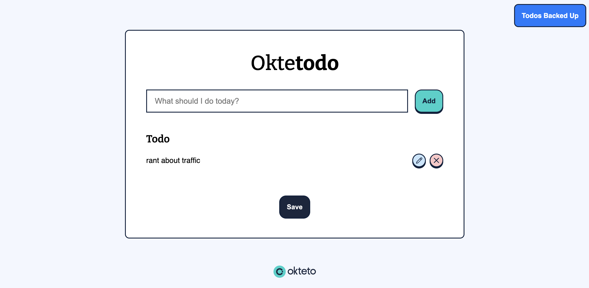

footer: @oktetohq
slide-transition: true
build-lists: true

# [fit] Why We Chose to Build a

# [fit] **Developer Platform**

# [fit] on Top of Kubernetes

Arsh Sharma, Okteto
Twitter: @RinkiyaKeDad
LinkedIn: /arsh4

---

# What is a Developer Platform?

> Gartner predicts that by 2026, 80% of large software engineering organizations will have platform engineering teams, up from 45% in 2022. For most organizations, the first step to embracing platform engineering is adopting a developer platform.

It is key in defining the **developer experience** for your organization.

---

<br>
<br>
<br>
# Why is it important?

---

# Becuase the developer experience for cloud native apps is

## [fit] **broken**

---

# Current Cloud Native DevX



---

# Current Cloud Native DevX

- microservices code
- databases
- cloud services
- devops tools like terraform, helm, etc


---

# Why Kubernetes for Dev Platforms?

- Containerized Environment
- Consistency Across Environments
- Service Discovery
- Scalability and Resource Efficiency
- Ecosystem and Extensibility

---

## Okteto CLI

- [github.com/okteto/okteto](https://github.com/okteto/okteto)
- **Platform Engineers**: Define dev environments which will run on K8s
- **Developers**: One click deploy and develop applications directly in the cluster (`okteto up`)

---

## [fit] **Demo!**

---

## **Try it out!**


---

## Build Section


```yaml
build:
  server:
    context: server
  client:
    context: client
```

---

## Deploy Section


```yaml
deploy:
  image: hashicorp/terraform:1.4

  commands:
    - name: Create the AWS S3 Bucket
      command: |
        terraform init -input=false
        terraform apply -input=false -auto-approve

    - name: Create the AWS secret
      command: |
        kubectl apply -f aws-secret.yaml
```

---

## Deploy Section


```yaml
deploy:
    ...
  - name: Deploy the DB
    command: helm upgrade --install db db/chart

  - name: Deploy the Node.js Backend
    command: helm upgrade --install server server/chart \
             --set image=${OKTETO_BUILD_SERVER_IMAGE} \
             --set bucket="$S3_BUCKET_NAME"

  - name: Deploy the React Frontend
    command: helm upgrade --install client client/chart \
             --set image=${OKTETO_BUILD_CLIENT_IMAGE}
```

---

## Develop Section


```yaml
dev:
  server:
    command: bash
    sync:
      - server:/app
  client:
    command: npm start
    sync:
      - client:/app
```

---

# [fit] **Thanks**

# [fit] **for attending!**

Try Okteto for free at: [okteto.com](https://okteto.com)

---

## **Feedback + Giveaway!**


